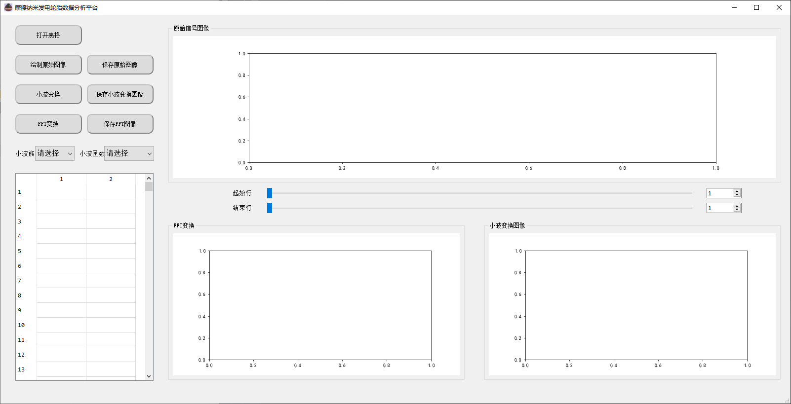
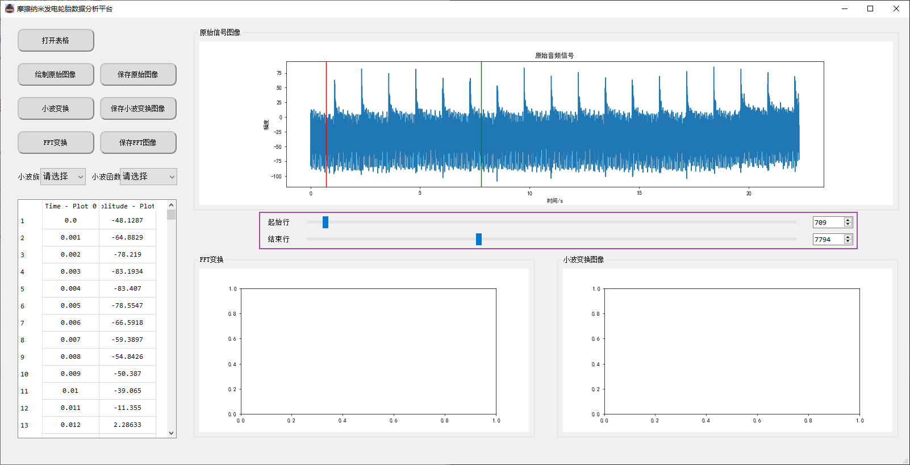
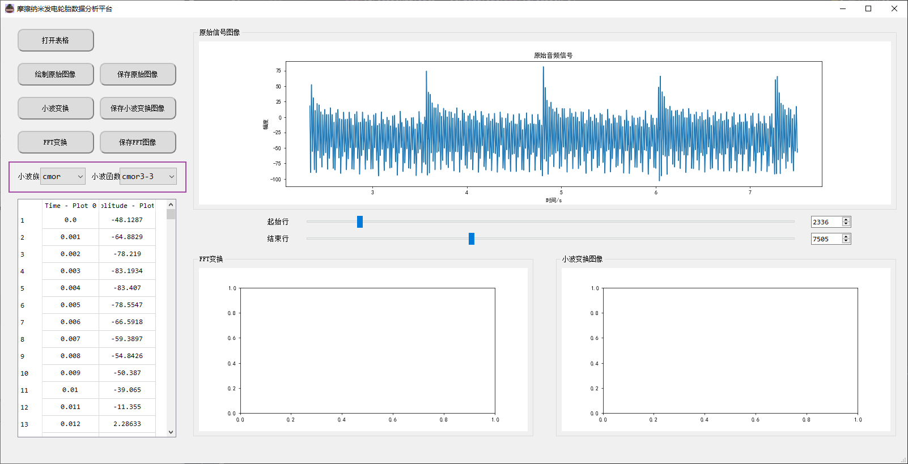
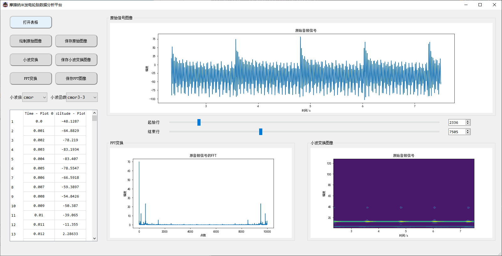

### 摩擦纳米发电轮胎数据分析平台

#### 版本号：V1.2

#### 更新说明：

- 添加可视化数据截取功能
- 添加表格导入，以及表格数据显示
- 添加小波变换以及FFT变换功能
- 添加所有图表的保存功能
- 封装为exe文件执行

### 使用说明

#### 主界面

#### 选择截取数据段

#### 选择小波族与小波函数（cmor与cgus使用没bug，其他可能会有bug）

#### 进行小波变换和FFT变换，并保存图像

